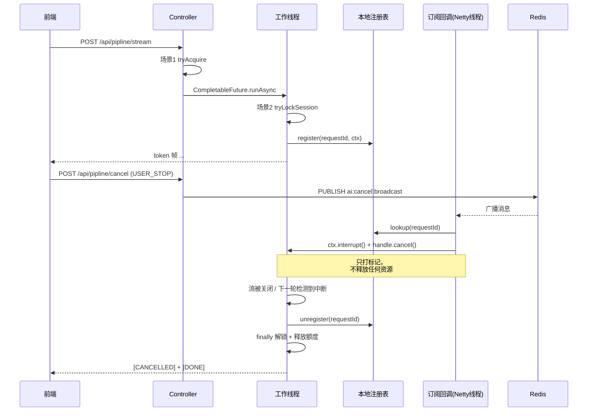
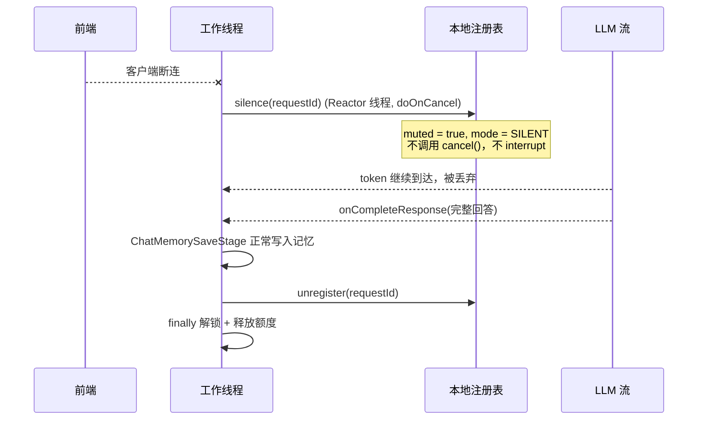

# 场景 3 设计文档：基于 Redis Pub/Sub 的主动取消与推理任务秒级回收

> 状态：**设计中**（未开工）。
> 文中 LangChain4j 的 API 签名已对照官方源码核实，标注了 `@since` 与「官方未约定」的部分。

---

## 1. 目标与非目标

### 目标

1. 用户点「停止生成」时，**秒级**中断正在进行的 LLM 推理流并回收资源。
2. 前端异常断连时，**不中断推理**，转静默模式把回答生成完再回收资源（见 §5）。
3. 级联回收：本地注册表清理 + 场景 1 的并发额度（ZREM）+ 场景 2 的会话锁（unlock）。
4. 跨节点：USER_STOP 指令广播到所有实例，只有**持有该 requestId 的实例**真正执行，其余忽略。

### 非目标

- 不做取消后的业务补偿（半截回答怎么处理，见 §14 待决策 1）。
- 不做任务优先级/排队调度。
- 不做「重连后取回静默完成的回答」（见 §5.7 方案 C）。
- 不改动 `/fack` 同步接口的取消能力（同步调用没有"中途取消"的交互场景，但仍复用同一套注册表以便未来扩展）。

---

## 2. 三层防护的整体关系

```
请求进来
  │
  ├─ 场景 1  并发额度 ZSet      「防超发」    → 保护 GPU 总量
  │
  ├─ 场景 2  会话锁 RLock       「防冲突」    → 保护单会话上下文一致性
  │
  └─ 场景 3  取消/静默 Pub/Sub  「防浪费」    → 保护资源回收时效
                                   ↓
                          不自己释放资源，只负责"打标记"
```

三层的关键差异：**场景 1/2 是"入口管控"，场景 3 是"出口处置"。**

---

## 3. 数据结构

### 3.1 Redis 侧

| 名称 | 类型 | 说明 |
|---|---|---|
| `ai:cancel:broadcast` | Pub/Sub channel | USER_STOP 指令广播频道。所有实例都订阅 |
| `ai:cancel:flag:{requestId}` | String（可选） | 取消标记，`SET NX EX 60`。用于兜底「广播漏消息」（见 §9.2） |

**消息 payload**：JSON 字符串（不是 POJO）

```json
{
  "requestId": "8f14e45f-ea0e-4c1a-9d0b-2c5f6a7b8c9d",
  "userId": "s1",
  "sessionId": "s1",
  "intent": "USER_STOP",
  "ts": 1758500000000
}
```

**为什么用 JSON 字符串而不是 POJO**：
Redisson 的 `RTopic` 默认使用全局 codec（Kryo5），传 POJO 需要收发两端类结构完全一致，跨版本易碎。
用 `redissonClient.getTopic(NAME, StringCodec.INSTANCE)` + JSON 字符串，两端零耦合，Python 侧也能直接消费。

**intent 取值**：

| 值 | 是否走广播 | 说明 |
|---|---|---|
| `USER_STOP` | ✅ 必须广播 | 用户主动停止，硬中断 |
| `CLIENT_DISCONNECT` | ❌ 本地直调 | 前端断连，软中断（静默），见 §5.3 |
| `SILENT_TIMEOUT` | ❌ 本地降级 | 静默超上限，降级为硬中断（§5.5） |

### 3.2 本地内存侧：`ActiveTaskRegistry`

```java
// 只在单个实例内存里，不落 Redis
ConcurrentHashMap<String, ActiveTask> registry = new ConcurrentHashMap<>();

enum TaskMode {
    RUNNING,      // 正常流式输出
    SILENT,       // 已断连，停止推流但继续生成
    CANCELLING,   // 已决定硬中断
    FINISHED      // 终态（CANCELLED / COMPLETED 都归到这里）
}

class ActiveTask {
    final String requestId;
    final String userId;
    final String sessionId;
    final ChatPipelineContext ctx;      // 用于 ctx.interrupt(...)
    final Thread workerThread;          // 诊断用
    final long startedAt;               // 排查耗时

    volatile StreamingHandle streamingHandle;  // 仅流式调用期间非空
    volatile TaskMode mode = TaskMode.RUNNING;
    volatile boolean muted;                     // 静默开关：true 时 token 不再推给前端
    volatile long silentSince;                  // 进入 SILENT 的时间戳，用于超时降级
}
```

| 字段 | 为什么需要 |
|---|---|
| `ctx` | 取消时调用 `ctx.interrupt(reason)`，让 `ChatPipelineExecutor` 在 stage 边界退出 |
| `streamingHandle` | 唯一能真正秒级中断的手段，来自 LangChain4j 的回调上下文 |
| `mode` | 中断意图的状态机（§5.6），保证状态只在合法方向迁移 |
| `muted` | 静默开关。与 `mode` 分开是因为「停止推流」和「是否中断」是两件事 |
| `silentSince` | 静默超时降级的判据 |
| `workerThread` | 诊断用。**不要用 `Thread.stop()`** |
| `startedAt` | 排查"取消延迟"指标 |

> `streamingHandle` / `mode` / `muted` / `silentSince` 必须 `volatile`：
> **Pub/Sub 回调线程（Redisson Netty 线程）与 Reactor 线程写，工作线程读。**

---

## 4. 广播协议

### 4.1 为什么 USER_STOP 用广播而不是点对点

- 前端只知道自己发过一个 `requestId`，**不知道这个任务跑在哪个实例上**（后端无状态 + 负载均衡）。
- 广播后各实例**本地查表**：命中才处理，未命中直接忽略。
- 代价是 N 个实例各有一次无效回调，成本极低（内存查表 + 一次无操作的 return）。

> CLIENT_DISCONNECT 是例外，**不需要广播**，理由见 §5.3。

### 4.2 订阅实现选择

| 方案 | 评价 |
|---|---|
| **Redisson `RTopic`** | ✅ 采用。项目已有 `RedissonClient`，代码量最小，断线重连由 Redisson 内部处理 |
| Spring `RedisMessageListenerContainer` | ✗ 需要额外配置线程池与序列化器，与现有 Redisson 体系重复 |

注意事项：

1. `getTopic(name, StringCodec.INSTANCE)` 必须显式指定 codec，否则和 `RedisTemplate` 里的字符串对不上。
2. 监听器里的异常**必须自己吞掉**，否则会在 Netty 线程上抛出，影响订阅连接。
3. Pub/Sub 断连期间的消息**会丢**（这是 Redis Pub/Sub 的本质，不是 Redisson 的问题）→ §9.2 兜底。

---

## 5. 两种中断意图（核心概念）

「前端不再接收数据」和「用户不要这个回答了」是两件事，必须分开处理，
否则要么浪费 GPU，要么把用户其实想要的回答丢掉。

### 5.1 定义

| 维度 | USER_STOP（主动停止） | CLIENT_DISCONNECT（异常断连） |
|---|---|---|
| 触发场景 | 用户点「停止生成」按钮 | 关网页、断网、锁屏、切后台 |
| 用户意图 | 「我不想看了，立刻停下，别浪费钱」 | 「我可能只是网断了，你帮我生成完，我回头再看」 |
| 中断类型 | **硬中断** | **软中断（静默模式）** |
| 对 LLM 调用 | 立刻 `streamingHandle.cancel()` 切断 | **不切断**，继续生成 |
| 对上游推送 | 停止 | 停止（连接已断，本来就推不出去） |
| 对下游落库 | 不保存残缺回答（或仅存 `cancelled` 标记） | **静默写入完整回答** |
| 并发额度 | 立刻释放 | 生成自然结束后释放 |
| 会话锁 | 立刻释放 | 生成自然结束后释放 |

一句话：**USER_STOP 是「取消任务」，CLIENT_DISCONNECT 是「取消订阅，但任务继续跑」。**

### 5.2 这是有意的取舍

CLIENT_DISCONNECT 走静默看起来和场景 1 的初衷冲突（用户不看了还占 GPU），但：

- 用户断连 ≠ 用户不想要这个回答。直接取消会让「网抖一下」变成「回答凭空消失」，体验更差。
- 所以必须给静默加**上限**（见 §5.5），否则就退化成资源泄漏。

这也和 `/stream` 现有注释自洽：
> 「客户端断连时不要提前释放（此时 pipeline 还在跑），靠 ZSet 窗口 + EXPIRE 兜底即可」

### 5.3 CLIENT_DISCONNECT 不需要走 Pub/Sub

广播存在的唯一理由是**「前端不知道任务在哪个实例上」**。

| 意图 | 信号来源 | 是否需要广播 |
|---|---|---|
| USER_STOP | 前端新发 `POST /cancel`，可能被负载均衡打到**任意**实例 | ✅ **必须广播** |
| CLIENT_DISCONNECT | 本实例上那条 SSE 连接断开 | ❌ **不需要**，本地直调 |

`doOnCancel` 触发在**持有该 SSE 连接的实例**上，而同一条连接对应的 pipeline 就在同一实例（同一个 `requestId`）。所以：

```java
return sink.asFlux()
        .doOnCancel(() -> registry.silence(requestId, "CLIENT_DISCONNECT"));  // 本地直调，不走 Redis
```

好处：零网络开销、零延迟、不依赖 Pub/Sub 的可靠性。
（若为了架构统一也可以走广播，但那属于「为统一而统一」。）

### 5.4 静默模式：换掉输出通道，而不是停掉任务

关键洞察：`ChatAgentStage` 里 `onCompleteResponse` 拿到的 `AiMessage` **本身就是完整回答**，
`future.get()` 返回后 `context.setFinalResult(...)`，`ChatMemorySaveStage` 会照常把整轮问答写入记忆。

所以静默**不需要累积器、不需要改落库逻辑**，只需要让 token 不再推给前端：

```java
// Controller 注册任务时构造
AtomicBoolean muted = new AtomicBoolean(false);
Consumer<String> upstream = sink::tryEmitNext;
Consumer<String> output = token -> {
    if (!muted.get()) {
        upstream.accept(token);
    }
};
ctx.setAttribute(ChatPipelineContext.STREAM_TOKEN_CONSUMER, output);
```

`muted` 这个开关挂到 `ActiveTask` 上，`doOnCancel` / 订阅回调只负责 `muted.set(true)`。

> ⚠️ **不要**把 `STREAM_TOKEN_CONSUMER` 置成 `null` 来表示静默。
> `ChatAgentStage` 用 `tokenConsumer == null` 判断「走非流式模型」，
> 置空会让**下一轮工具调用切换成非流式** `ChatModel.chat()`，行为突变。

> ⚠️ 也**不要**在 `doOnCancel` 里直接改 `ctx` 的 attributes：
> `attributes` 是普通 `HashMap`，非线程安全，且是 Reactor 线程写、工作线程读。
> 用 `AtomicBoolean` / `volatile` 字段作为唯一可变点。

### 5.5 静默模式的资源上限（必须做）

静默 = 资源继续被占用。断连后若 LLM 一直不结束（10 轮工具循环、或模型侧卡住），
资源会一直被占，**比直接取消更糟**。

```
maxSilentSeconds（待定，见 §14 待决策）
  超过后：SILENT → 硬中断（降级走 USER_STOP 的处理路径，intent 记为 SILENT_TIMEOUT）
```

注意场景 1 的 `window-seconds`（默认 300s）**不能**当静默上限 ——
它是跨实例僵尸 member 的兜底，粒度太粗（要等 5 分钟）。

实现方式（二选一，均不需引入 `@EnableScheduling`）：

| 方案 | 说明 |
|---|---|
| **JDK `ScheduledExecutorService`**（推荐） | 声明一个单线程 `@Bean`，注册任务时 `schedule(() -> degradeIfStillSilent(requestId), maxSilentSeconds, SECONDS)`，任务结束时 `future.cancel(false)` |
| Redisson `RScheduledExecutorService` | `redissonClient.getExecutorService(...)`，与 Pub/Sub 同属 Redisson 体系，但需要序列化任务体，偏重 |

### 5.6 状态机

```
                USER_STOP
   RUNNING ────────────────────> CANCELLING ────> FINISHED(CANCELLED)
      │                                              ↑
      │ CLIENT_DISCONNECT                            │
      └──────────────> SILENT ──(自然完成)──> FINISHED(COMPLETED)
                          │
                          └──(超过 maxSilentSeconds)──> CANCELLING
```

用单一 `volatile TaskMode mode` 表达，**只在合法状态下迁移**：

- `CANCELLING` 是终态方向，**不能再回到 `SILENT`**（一旦决定硬停，就别被后续断连信号"抢救"回来）
- `SILENT` 幂等，重复断连信号只生效一次
- 进入 `FINISHED` 后所有信号直接忽略

迁移规则表：

| 当前 | 收到 USER_STOP | 收到 CLIENT_DISCONNECT | 收到 SILENT_TIMEOUT |
|---|---|---|---|
| `RUNNING` | → `CANCELLING` | → `SILENT`（`muted=true`） | 忽略 |
| `SILENT` | → `CANCELLING` | 忽略（已静默） | → `CANCELLING` |
| `CANCELLING` | 忽略 | 忽略 | 忽略 |
| `FINISHED` | 忽略 | 忽略 | 忽略 |

### 5.7 ⚠️ 连带影响：静默期间会话锁被占更久

回答生成完之前会话锁一直被持有（这是对的，上下文一致性依然要保护）。但会出现：

> 用户断网 → 任务转静默继续跑 2 分钟 → 用户重连，想在同一会话重新提问
> → 被场景 2 的会话锁拒绝（409 / `[ERROR] 该会话正在处理中`）→ 用户困惑

三个缓解方向（待决策，见 §14）：

- **A. 接受**：靠 `maxSilentSeconds` 限制窗口，并在错误提示里说明「上一轮回答仍在生成」
- **B. 静默时提前释放会话锁**：**不推荐** —— 同一会话的记忆读写会重新产生竞态（正是场景 2 要解决的）
- **C. 支持重连后取回静默完成的回答**：属于新功能，超出本期

### 5.8 可观测性：两种意图必须分开统计

| 意图 | 含义 | 关注点 |
|---|---|---|
| `USER_STOP` | 产品体验：用户对回答不满意/不耐心 | 比例过高 → 查提示词质量、首 token 延迟 |
| `CLIENT_DISCONNECT` | 基础设施：网络不稳、移动端切后台 | 比例过高 → 查网络与超时配置 |

日志统一带 `requestId` + `intent` + `mode`（RUNNING/SILENT/CANCELLING），便于按 `requestId` 串起整条链路。

---

## 6. 取消的两级机制（仅 USER_STOP 适用）

> 注意：静默模式（CLIENT_DISCONNECT）**不走本节**，它只 `muted = true`，不动 LLM 调用。

| 级别 | 手段 | 生效时机 | 延迟 |
|---|---|---|---|
| **L1** | `ctx.interrupt("用户主动取消")` | 下一个 stage 边界；或 `ChatAgentStage` 工具循环的下一轮开始前 | **一次完整模型调用**（可能几十秒） |
| **L2** | `streamingHandle.cancel()` | 立即关闭与大模型的 HTTP 流 | **亚秒级** |

**必须两级都做**：L1 保证"无论如何最终会停"，L2 保证"秒级"。
只做 L1 达不到"秒级"这个目标；只做 L2 则在非流式（`chatModel.chat()`，即 `/fack` 路径）或工具调用轮次之间没有中断能力。

### 6.1 L2 的实现前提：必须覆写带 context 的重载

已核实的官方源码（`langchain4j-core`，`@since 1.8.0`）：

```java
public interface StreamingChatResponseHandler {

    default void onPartialResponse(String partialResponse) {}

    // ★ 要拿到 cancel 能力，必须覆写这个重载
    @Experimental
    default void onPartialResponse(PartialResponse partialResponse, PartialResponseContext context) {
        onPartialResponse(partialResponse.text());
    }

    void onCompleteResponse(ChatResponse completeResponse);
    void onError(Throwable error);
}
```

```java
public class PartialResponseContext {
    public StreamingHandle streamingHandle();
}

@Experimental
public interface StreamingHandle {
    void cancel();        // Cancels the streaming.
    boolean isCancelled(); // Returns true if streaming was cancelled by calling cancel().
}
```

**结论**：现在 `ChatAgentStage.chatOnceStreaming` 只覆写了 `onPartialResponse(String)`，
默认实现会走"无 context"那条路 —— **拿不到 `StreamingHandle`，也就无法秒级取消**。
必须改成覆写 `onPartialResponse(PartialResponse, PartialResponseContext)`。

### 6.2 改造后的形态（示意）

```java
model.chat(chatRequest, new StreamingChatResponseHandler() {

    @Override
    public void onPartialResponse(PartialResponse partialResponse, PartialResponseContext context) {
        // 1) 把句柄交给注册表，供取消广播随时调用
        registry.attachStreamingHandle(requestId, context.streamingHandle());

        // 2) 每收到一个 token 检查一次：硬中断优先，其次才是静默
        if (ctx.isInterrupted()) {
            context.streamingHandle().cancel();
            return;
        }
        if (registry.isMuted(requestId)) {
            return;   // 静默模式：丢弃 token，但不断开 LLM
        }

        tokenConsumer.accept(partialResponse.text());
    }

    @Override
    public void onCompleteResponse(ChatResponse response) {
        registry.detachStreamingHandle(requestId);
        future.complete(response.aiMessage());
    }

    @Override
    public void onError(Throwable error) {
        registry.detachStreamingHandle(requestId);
        future.completeExceptionally(error);
    }
});
```

---

## 7. 时序

### 7.1 USER_STOP（硬中断，走广播）



### 7.2 CLIENT_DISCONNECT（软中断，纯本地）



---

## 8. 线程与资源所有权（本设计最重要的一节）

| 动作 | 执行线程 | 允许？ |
|---|---|---|
| 注册 / 注销任务 | **工作线程**（`runAsync` 内） | ✅ |
| 打中断标记 `ctx.interrupt()` | 订阅回调线程 | ✅ 只能写 `volatile` / 原子字段 |
| 调用 `handle.cancel()` | 订阅回调线程 | ✅ |
| 静默 `muted = true` | **Reactor 线程**（`doOnCancel`） | ✅ 只能写 `volatile` / 原子字段 |
| 释放并发额度 `release()` | **只能工作线程** | ❌ 禁止在回调线程做 |
| 解锁会话 `unlockSession()` | **只能工作线程** | ❌ **绝对禁止**在回调线程做 |

**为什么解锁必须由工作线程做**：`RLock` 按 `clientUuid:threadId` 绑定持有者（场景 2 已踩过这个坑）。
在 Netty 回调线程里 `unlock()` 会抛 `IllegalMonitorStateException`，锁永远不释放，会话被永久锁死。

**单一所有权原则**：**状态标记可以多线程写，资源释放只归工作线程。**
这条原则让场景 3 天然避开了跨线程释放的所有问题。

---

## 9. 已知风险与必须验证的点

### 9.1 ⚠️ `cancel()` 之后 `CompletableFuture` 会怎样？（最高优先级）

已核对源码：`StreamingHandle.cancel()` 的 javadoc **只写了 "Cancels the streaming."**，
`PartialResponseContext` 和 `StreamingChatResponseHandler` 也**都没有约定**取消后是否触发
`onCompleteResponse` / `onError`。

**风险**：如果 `cancel()` 之后既不 complete 也不 error，那么
`ChatAgentStage.chatOnceStreaming` 里的 `future.get()` 会**永久阻塞** ——
工作线程卡死 → 额度、会话锁、注册表全部泄漏，**比不取消更糟**。

**对策（必须做，不能省）**：

1. `future.get(timeout, TimeUnit.SECONDS)` 加超时，超时后抛异常走正常失败路径。
2. 触发取消时**主动** `future.completeExceptionally(new CancellationException("用户取消"))`，
   不要依赖底层回调。
3. **实施第一步就写一个最小验证用例**：打日志观察 `cancel()` 之后的回调序列
   （是否有 `onError`？是否有 `onCompleteResponse`？都没有？），确认后再定超时值。

### 9.2 Pub/Sub 是 fire-and-forget

订阅者掉线/重连窗口内的消息会丢，且 Pub/Sub 没有 ack 机制。

**对策（分层兜底）**：

| 层级 | 手段 | 效果 |
|---|---|---|
| L1 | `ai:cancel:flag:{requestId}` `SET NX EX 60`，工作线程在每轮工具循环开始时查一次 | 补上漏掉的广播 |
| L2 | `onPartialResponse` 里逐 token 检查 `ctx.isInterrupted()` | 只要还在流式输出就能兜住 |
| L3 | 场景 1 的 `window` + 场景 2 的看门狗 | 最终一定会释放，只是延迟大 |

L1 是可选项（多一次 Redis 查询），L2 成本几乎为零建议保留。
注意：CLIENT_DISCONNECT 不走广播，因此不受本节影响。

### 9.3 注册表内存泄漏

- 必须在 `finally` 里 `unregister(requestId)`，且放在解锁/释放额度**之前或之后都可以**，但一定要在同一个 `finally` 里。
- 注册时若发现同 `requestId` 已存在 → 覆盖并打 `warn`（正常不该发生）。
- 可选兜底：低频巡检清掉 `startedAt` 超过阈值（如 10 分钟）的僵尸条目，同时打 `error` 告警
  —— 出现僵尸就说明某个 `finally` 没跑到。

### 9.4 前端断连感知：`Flux` 而不是 `SseEmitter`

`todo.txt` 里写的是「利用 Spring SseEmitter 的 onCompletion/onTimeout/onError」，
但**项目实际用的是 `Flux` + `Sinks.Many`，没有 `SseEmitter`**，需要对齐成：

```java
return sink.asFlux()
        .doOnCancel(() -> registry.silence(requestId, "CLIENT_DISCONNECT"));
```

注意三点：

1. `doOnCancel` 只在**订阅方取消**时触发（客户端断连正是这种情况）；
   我们自己 `sink.tryEmitComplete()` 属于 `COMPLETE`，**不会**触发 `doOnCancel`，所以不会形成自我取消的环。
2. `doOnCancel` 里**只做静默标记**，不要直接释放资源 —— 遵守 §8 的单一所有权原则。
3. 这里**本地直调**，不 publish 到 Redis（理由见 §5.3）。

### 9.5 SSE 收尾帧协议

| 场景 | 推什么 | 说明 |
|---|---|---|
| 正常完成 | `[DONE]` | 现有行为，不变 |
| USER_STOP | `[CANCELLED]` + `[DONE]` | 让前端区分「正常结束」和「被取消」 |
| CLIENT_DISCONNECT | **不推** | 前端已断开，帧推不出去。`tryEmitNext` 返回非 OK 但**不抛异常**，可安全忽略 |
| SILENT_TIMEOUT 降级 | **不推** | 同 CLIENT_DISCONNECT |

### 9.6 静默模式下的落库语义

静默模式走完了整条 pipeline，`ChatMemorySaveStage` 会正常把「用户问题 + 完整回答」写入会话记忆，
**不需要额外累积器**（`AiMessage` 本身就是完整回答）。

但要注意与 §14 待决策 1 的交互：**USER_STOP 时 `finalResult` 为 null，记忆不会写入**，
于是会出现「同一会话里 USER_STOP 的问题没有回答、CLIENT_DISCONNECT 的问题有回答」的不一致。
两个意图的落库策略需要一起定。

---

## 10. 接口设计

```
POST /api/pipline/cancel
Content-Type: application/json

{ "requestId": "8f14e45f-...", "intent": "USER_STOP" }
```

响应：

```json
{ "code": 200, "message": "Success", "data": { "accepted": true, "local": true } }
```

| 设计点 | 说明 |
|---|---|
| 为什么返回 200 而不是 404 | 广播语义下，发布者**不知道**任务在哪台机器；本实例没命中不代表取消失败 |
| `local` 字段 | 本实例是否持有该任务。排查用；单实例部署时恒等于"取消失败"与否 |
| 幂等 | 重复取消返回同样结果；状态机保证只在合法状态下迁移（§5.6） |
| 参数校验 | `requestId` 为空直接返回 400 |
| 只接受 `USER_STOP` | 该接口用于「用户主动停止」。`CLIENT_DISCONNECT` 由 `doOnCancel` 本地触发，不开放为 HTTP 入口 |

---

## 11. 与场景 1 / 2 的协作总览

| 关注点 | 场景 1 | 场景 2 | 场景 3 |
|---|---|---|---|
| 数据结构 | Redis ZSet | Redis Hash（RLock） | Redis Pub/Sub + 本地 Map |
| 保护目标 | GPU 总量 | 单会话上下文一致性 | 资源回收时效 |
| 谁释放资源 | 工作线程 finally | 工作线程 finally | **不释放，只打标记** |
| 失败反馈 | HTTP 429 | 409 / `[ERROR]` 帧 | — |
| 兜底机制 | window + EXPIRE | 看门狗续期 | cancel flag + 静默上限 + 上述两者 |
| 依赖关系 | 提供 requestId | 提供 finally 释放点 | **复用前两者的产物** |

**场景 3 是场景 1/2 的"出口处置"**：它不引入新的资源所有权，只是决定既有的 `finally` 是「立刻触发」还是「等生成完再触发」。

---

## 12. 实施清单（待确认后开工）

| # | 文件 | 动作 | 内容 |
|---|---|---|---|
| 1 | `common/redis/RedisKey.java` | MODIFY | 新增 `CANCEL_CHANNEL` / `cancelFlag(requestId)` |
| 2 | `module/chat/model/dto/TaskCancelCommand.java` | NEW | 广播 payload（JSON 序列化用），含 `intent` 字段 |
| 3 | `module/chat/service/ActiveTaskRegistry.java` | NEW | 注册表 + `ActiveTask` + `TaskMode` 状态机 + `silence()` / `cancel()` 迁移逻辑 |
| 4 | `module/chat/service/ChatCancelService.java` | NEW | `publish()`（仅 USER_STOP）+ `@PostConstruct` 订阅频道 + 静默超时调度 |
| 5 | `module/chat/order/stages/chatStage/ChatAgentStage.java` | MODIFY | 覆写带 context 的 `onPartialResponse`；`future.get` 加超时；静默时丢弃 token；轮次开始查 `ctx.isInterrupted()` |
| 6 | `module/chat/controller/ChatPiplineController.java` | MODIFY | 注册/注销任务；包装输出通道（`AtomicBoolean muted`）；`doOnCancel → registry.silence()`；新增 `/cancel` 接口 |
| 7 | `doc/todo.txt` | MODIFY | 替换场景 3 说明 + 语义缓存移到远期（需 Redis Stack） |

---

## 13. 验证方案

| # | 场景 | 期望 |
|---|---|---|
| 1 | 单实例：开一个长回答的流，中途 `POST /cancel` | 流 ~1s 内停止；收到 `[CANCELLED]` + `[DONE]` |
| 2 | 取消延迟测量 | 对比 publish 时间戳与工作线程退出时间戳，**要求 < 2s** |
| 3 | 资源回收（USER_STOP） | 取消后立刻查 `ZCARD ai:concurrent:s1` = 0，`EXISTS ai:session:lock:s1` = 0 |
| 4 | 注册表 | 结束后注册表 size 归零 |
| 5 | 工具循环中途取消 | 让模型走工具调用，在工具执行期间取消 → 下一轮开始时中断 |
| 6 | **前端断连（软中断）** | Ctrl+C 掉 curl → 注册表 `mode = SILENT`、`muted = true`；<br/>**`ZCARD` 仍为 1**（任务继续跑），日志能看到 token 被丢弃；<br/>生成自然结束后 `ZCARD` 归零、`EXISTS lock` = 0，且**记忆里有完整回答** |
| 7 | 静默超时降级 | 把 `maxSilentSeconds` 调到 10s，断连后不做任何操作 → 10s 后 `mode → CANCELLING`，资源释放 |
| 8 | `cancel()` 后的回调序列 | 关键验证项，用于确定 §9.1 的超时策略 |
| 9 | 重复取消 | 连发两次 `/cancel`，第二次不报错、不重复 `cancel()` |
| 10 | 状态迁移合法性 | 断连后再 `/cancel`：`SILENT → CANCELLING` 应成功；<br/>`/cancel` 后再断连：`CANCELLING` 忽略断连信号 |

---

## 14. 待决策（开工前需要你拍板）

1. **「半截回答」在两个意图下分别怎么处理？**
   现在 `ChatMemorySaveStage` 在 `finalResult == null` 时会 `interrupt("模型未返回最终结果，未写入记忆")`，
   即 USER_STOP 的半截回答**不会落库**；而 CLIENT_DISCONNECT 会落完整回答。
   三个选项：
   - A. 保持现状：USER_STOP 丢弃残缺回答（可能出现"同一会话里，主动停的没回答、断连的有回答"）
   - B. USER_STOP 也落库，标记 `cancelled`（需要把流式累积的部分文本保存下来）
   - C. USER_STOP 时连用户消息一起回滚（记忆里完全不留这一轮）
2. **`maxSilentSeconds` 取多少？**（§5.5，需覆盖最坏情况：10 轮工具调用的总耗时）
3. **静默期间会话锁被占更久，选哪个缓解方案？**（§5.7 的 A / B / C）
4. **要不要做 `ai:cancel:flag` 双保险？**（§9.2 L1，代价是每轮工具循环多一次 Redis 查询）
5. **`/cancel` 接口放哪？** 放 `ChatPiplineController`（就近，但该类的练习说明 Javadoc 已较杂），
   还是新建 `ChatTaskController`（职责更清晰）？
