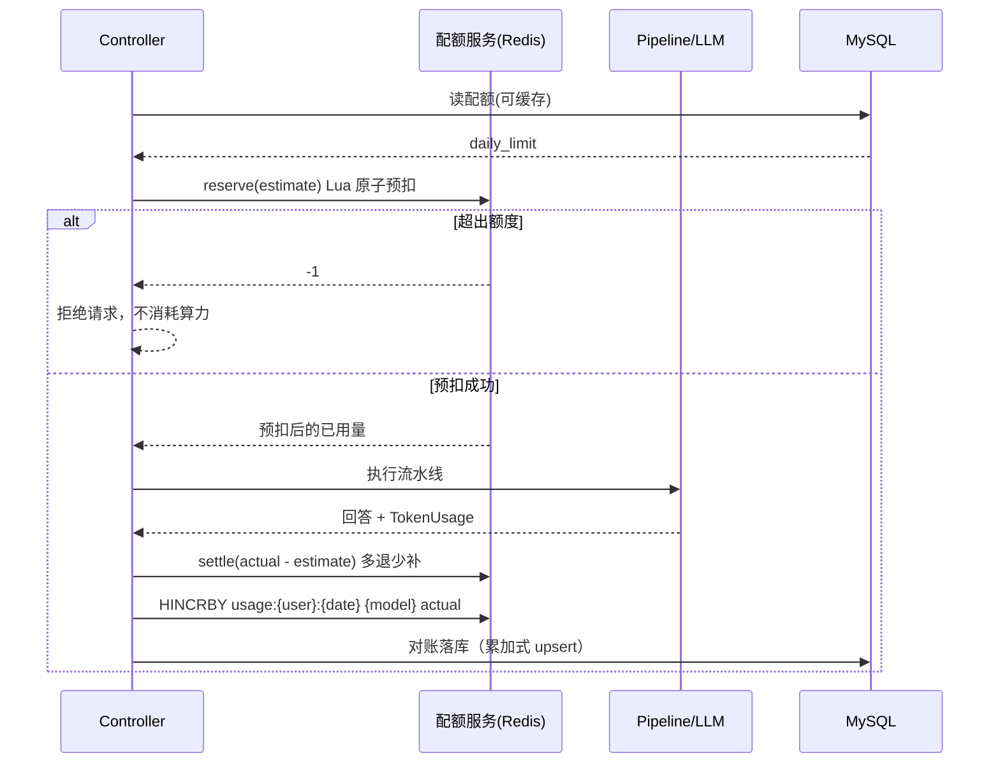

# 每日 Token 配额：原子扣减与用量统计 —— 方案

> 状态：**数据库侧已就绪**，Redis 侧待实现。
> 表结构与字段以 `doc/sql/init_user_quota.sql` 为准，本文档补充设计意图、键设计、易错点与接线点。

---

## 1. 分工

| 角色 | 负责内容 | 状态 |
|---|---|---|
| 数据库侧 | `sys_user` / `ai_user_token_quota` / `ai_user_daily_token_usage` 三张表的建表脚本、实体、Mapper、`@MapperScan` | ✅ 已完成 |
| Redis 侧 | 每日额度的原子预扣与结算、按模型的当日用量累计 | ⬜ 待实现 |
| 接入层 | 在对话入口做预扣、在流水线结束后做结算，并对账落库 | ⬜ 后续开发 |

**本方案不含任何 Service / Controller 代码**，`AiUserDailyTokenUsageMapper` 只有 `BaseMapper` 的基础能力，累加式 upsert 需要你自己加。

---

## 2. 数据库表

执行方式（二选一）：

```powershell
# 方式 A：用 MySQL 客户端直接打开 doc/sql/init_user_quota.sql 执行
# 方式 B：命令行导入（PowerShell 不支持 < 重定向，要先 docker cp 进容器；已实测可用）
docker cp doc/sql/init_user_quota.sql vllmpt-mysql:/tmp/init_user_quota.sql
docker exec vllmpt-mysql sh -c "mysql -uroot -proot123 vllmpt_dev < /tmp/init_user_quota.sql"
docker exec vllmpt-mysql rm -f /tmp/init_user_quota.sql
```

脚本用 `CREATE TABLE IF NOT EXISTS` + 幂等插入，可重复执行。初始化数据给了 `id=1 / test_user`，日额度 10 万，方便 Redis 键名直接写成 `ai:quota:1:20260923`。

### 2.1 `sys_user`（用户表）

| 列 | 类型 | 说明 |
|---|---|---|
| `id` | BIGINT PK AI | 用户 ID |
| `username` | VARCHAR(64) UNIQUE | 登录名 |
| `nickname` / `email` / `phone` | VARCHAR | 基础信息 |
| `password_hash` | VARCHAR(128) | 密码哈希，不存明文 |
| `status` | TINYINT | 1=启用 0=禁用 |
| `deleted` | TINYINT | 逻辑删除，**必须存在**（见 §5.1） |
| `created_at` / `updated_at` | DATETIME | 数据库默认值填充 |

### 2.2 `ai_user_token_quota`（配额表）

| 列 | 说明 |
|---|---|
| `user_id` | UNIQUE，一个用户一行 |
| `daily_limit` | **每日额度上限，这是预扣判断阈值的唯一权威来源** |
| `monthly_limit` | 月额度，`0` = 不限制 |
| `used_today` / `used_month` | MySQL 侧对账冗余。**不要用它们做限额判断**，热路径以 Redis 计数为准 |
| `quota_enabled` | 1=启用 0=不限制（可以给某些用户开白名单） |
| `effective_from` / `effective_to` | 配额生效区间，为 NULL 表示不限。用于活动赠额场景 |
| `remark` | 备注，如"双十一活动赠额" |
| `deleted` | 逻辑删除 |

> 为什么用独立表而不是往 `sys_user` 加一列：后面要按用户等级、活动期做差异化额度时，加字段比改表更灵活；`effective_from/to` 也自然落在这里。

### 2.3 `ai_user_daily_token_usage`（每日用量表）

按「用户 + 日期 + 模型」一行。

| 列 | 说明 |
|---|---|
| `user_id` / `stat_date` / `model_name` | **唯一键 `uk_user_date_model`**，对账 upsert 的依据 |
| `prompt_tokens` / `completion_tokens` | 输入/输出分列。当前统计口径是"总量"，但模型返回的用量天然包含这两项，保留后以后要按输入输出分别定价不用改表 |
| `total_tokens` | 总 token 累计 |
| `request_count` | 请求次数 |
| `estimated_cost` | 预估费用，用 `ai.models[*].price-per-token` × tokens 算 |
| `deleted` | 逻辑删除（本表**不建议**用逻辑删除，见 §5.2） |

索引与查询的对应关系：

| 索引 | 支撑的查询 |
|---|---|
| `uk_user_date_model` | 单用户某天的明细（按模型拆开） |
| `idx_user_date` | 单用户某日期区间的汇总 |
| `idx_stat_date` | 某一天全部用户的排行 |

**当日合计不单独存行**，用聚合得出：

```sql
SELECT SUM(total_tokens)
  FROM ai_user_daily_token_usage
 WHERE user_id = ? AND stat_date = ? AND deleted = 0;
```

---

## 3. Redis 侧设计（待你实现）

### 3.1 键设计

| 键 | 结构 | 说明 |
|---|---|---|
| `ai:quota:{userId}:{yyyyMMdd}` | String | **当日已用 token 总量**。预扣与结算都操作它，是热路径上的原子计数器 |
| `ai:usage:{userId}:{yyyyMMdd}` | Hash | field = `modelName`，value = 该模型当日累计 token。用于"这个用户的额度花在哪个模型上" |
| `ai:quota:limit:{userId}` | String（可选） | 日额度的缓存，避免每个请求都查 MySQL；配额变更时删掉这个键即可 |

日期用 `Asia/Shanghai` 的 `yyyyMMdd`（与 `application.yml` 里配的时区一致）。

### 3.2 预扣（请求发出前）

必须把「读取已用 + 判断 + 写入」放在**同一个 Lua 脚本**里，否则并发下会出现"判断时够、写入时被抢走"的超发。

```lua
-- KEYS[1] = ai:quota:{userId}:{yyyyMMdd}
-- ARGV[1] = estimateTokens   本次预估消耗
-- ARGV[2] = dailyLimit       日额度上限
-- ARGV[3] = expireAtEpochSec 过期时间点（秒级时间戳）
--
-- 返回 >= 0 : 预扣成功，值为预扣后的已用量
-- 返回 -1   : 超出当日额度，拒绝
local key      = KEYS[1]
local estimate = tonumber(ARGV[1])
local limit    = tonumber(ARGV[2])

local used = tonumber(redis.call('GET', key) or '0')
if used + estimate > limit then
    return -1
end

local after = redis.call('INCRBY', key, estimate)
if after == estimate then
    -- 首次写入才设置过期，避免每个请求都刷新 TTL
    redis.call('EXPIREAT', key, ARGV[3])
end
return after
```

调用侧（Redisson + `StringCodec`，与场景 1 的写法保持一致）：

```java
Long r = redissonClient.getScript(StringCodec.INSTANCE).eval(
        RScript.Mode.READ_WRITE, LUA_RESERVE, RScript.ReturnType.LONG,
        List.of(quotaKey),
        String.valueOf(estimate), String.valueOf(limit), String.valueOf(expireAt));
// r == null || r < 0 → 拒绝
```

**估算值怎么取**（这一点很容易误拒）：
- 直接用 `maxTokens`（8192）会在用户只剩 100 token 时直接拒绝，但它其实只需要几十个 token
- 更合理的做法：`estimate = min(maxTokens, dailyLimit - used)`，即"能扣多少扣多少"
- 或者用历史的平均消耗作为估算值

### 3.3 结算（模型返回后）

多退少补，差额落在**同一个 key** 上：

```java
long diff = actualTokens - estimateTokens;               // 可为负，即"退"
if (diff != 0) {
    redissonClient.getBucket(quotaKey, StringCodec.INSTANCE).addAndGet(diff);
}
// 分模型累计
redissonClient.getMap(usageKey, StringCodec.INSTANCE).addAndGet(modelName, actualTokens);
```

注意 `RMap.addAndGet` 是**原子**的；但首次创建 `usageKey` 时要补一次 `EXPIREAT`。

### 3.4 TTL 策略

`EXPIREAT` 设到 **`statDate + 2 天` 的 0 点**，而不是当天 0 点：

- 设到当天 0 点 → 当天还没结束键就没了，属于严重 bug
- 留 2 天是给跨零点请求与对账任务留缓冲

### 3.5 配额来源

请求链路里读 `ai_user_token_quota`：

```
quota_enabled = 1
AND (effective_from IS NULL OR effective_from <= NOW())
AND (effective_to   IS NULL OR effective_to   >= NOW())
```

拿到 `daily_limit` 后传给 Lua。`quota_enabled = 0` 表示该用户不限制，直接跳过错额判断（但仍建议记录用量）。

建议在本地加一层短 TTL 缓存（Caffeine 或 `ConcurrentHashMap` + 过期时间），避免每个请求一次 MySQL 查询；配额变更时清缓存。

---

## 4. 时序



---

## 5. 四个必须注意的坑

### 5.1 表必须有 `deleted` 列

`application.yml` 里全局配了：

```yaml
mybatis-plus:
  global-config:
    db-config:
      logic-delete-field: deleted
```

MyBatis-Plus 会给**所有**查询自动拼上 `deleted = 0`。三张表都已经带了这一列，**后续新建表也别忘了**，否则一查就 `Unknown column 'deleted' in 'where clause'`。

### 5.2 对账写入必须"累加"，不能"覆盖"

这是本场景最容易埋的坑。唯一键 `uk_user_date_model` 让你可以直接 upsert，但写法必须是累加：

```sql
-- ✅ 正确：累加
INSERT INTO ai_user_daily_token_usage
    (user_id, stat_date, model_name, prompt_tokens, completion_tokens, total_tokens, request_count)
VALUES (?, ?, ?, ?, ?, ?, ?)
ON DUPLICATE KEY UPDATE
    prompt_tokens     = prompt_tokens     + VALUES(prompt_tokens),
    completion_tokens = completion_tokens + VALUES(completion_tokens),
    total_tokens      = total_tokens      + VALUES(total_tokens),
    request_count     = request_count     + VALUES(request_count);

-- ❌ 错误：覆盖，会把已有累计冲掉
ON DUPLICATE KEY UPDATE total_tokens = VALUES(total_tokens)
```

> `VALUES(col)` 在 MySQL 8.0.20+ 被标记为过时（仍可用）。如果确定是 8.0.19+，可以换成别名写法：
> `INSERT INTO t (...) VALUES (...) AS new ON DUPLICATE KEY UPDATE total_tokens = total_tokens + new.total_tokens`

### 5.3 跨零点：预扣与结算必须落在同一个键上

请求在 `23:59:59` 预扣、`00:00:01` 结算时，如果两次都重新取"当天日期"，差额会写到**两个不同的键**上，导致：

- 昨天的键多了一笔预扣，永远退不回来
- 今天的键被减了一笔从未预扣的量，可能变成负数

**做法**：预扣时把 `quotaKey` 与 `statDate` 一起记录下来（建议放进 `ChatPipelineContext` 的 attribute），结算时直接复用，不要重新计算日期。

```java
ctx.setAttribute("quotaKey", quotaKey);
ctx.setAttribute("statDate", statDate);
// ...
// 结算时：
String quotaKey = (String) ctx.getAttribute("quotaKey");
```

### 5.4 流式场景下 `tokenUsage()` 可能是 null

已核实用到的 LangChain4j API（`langchain4j-core` 1.16.2，`javap` 确认）：

```java
public class ChatResponse {
    public AiMessage aiMessage();
    public TokenUsage tokenUsage();
    public String modelName();
    public FinishReason finishReason();
}

public class TokenUsage {
    public Integer inputTokenCount();     // 注意是 Integer，可能为 null
    public Integer outputTokenCount();
    public Integer totalTokenCount();
    public static TokenUsage sum(TokenUsage, TokenUsage);
    public TokenUsage add(TokenUsage);
}
```

两个坑：

1. **`Integer` 可能为 null**，取值要判空，否则结算时 NPE。
2. **流式（`/stream` 路径）不一定有 usage**。OpenAI 兼容接口默认只在非流式响应里返回 `usage`；流式要在请求里带 `stream_options: {"include_usage": true}`，才会在最后一个 chunk 返回。**这一点需要你实测确认**：如果流式拿不到 usage，就得退化成"用估算值结算"或"本地 tokenizer 计数"。
3. **工具轮次要累加**。`ChatAgentStage` 最多 10 轮模型调用，`tokenUsage` 应当把每轮的 用量加起来，而不是只取最后一轮：

```java
TokenUsage total = null;
// 每轮拿到 resp 后
TokenUsage u = resp.tokenUsage();
if (u != null) {
    total = (total == null) ? u : TokenUsage.sum(total, u);
}
```

---

## 6. 与现有代码的接线点

### 6.1 预扣 / 结算插入位置

两个接口都在 `module/chat/controller/ChatPiplineController.java`。

**`/fack`**（同步）：额度申请在第 80 行左右，预扣插在它之后、`executor.execute` 之前；结算插在 `finally` 里。

```java
boolean res = concurrentLimitService.tryAcquire(userId, requestId);
if ( !res)
    throw new BusinessException(CODE_TOO_MANY_CONCURRENT ,"您的并发请求过多，请稍后重试") ;

// ↓↓↓ 在这里插入预扣：拿 dailyLimit → Lua 预扣 → 把 quotaKey/statDate/estimate 写进 ctx
//     预扣失败直接抛 BusinessException(429, "今日 Token 额度已用完")

boolean sessionLocked = false;
try {
    // ... 原有逻辑
    executor.execute(chatPipeline, ctx);
    // ...
} finally {
    // ↓↓↓ 在这里插入结算：从 ctx 取 TokenUsage 与 quotaKey，做多退少补 + 分模型累计
    if (sessionLocked) { sessionLockService.unlockSession(sessionId); }
    concurrentLimitService.release(userId,requestId);
}
```

**`/stream`**（流式）：额度申请在第 143 行左右，**同样必须插在 `return sink.asFlux()` 之前**（理由和并发额度一样：一旦返回 `text/event-stream` 就改不了状态码了）。结算在 `CompletableFuture.runAsync` 的 `finally` 里。

### 6.2 真实用量的取得路径

当前 `ChatAgentStage` **只取用了 `aiMessage()`，没有读 `tokenUsage()`**，这是结算前必须补的一步：

```java
// 非流式分支（现为 chatModel.chat(chatRequest).aiMessage()）
ChatResponse response = chatModel.chat(chatRequest);
AiMessage aiMessage = response.aiMessage();
TokenUsage usage = response.tokenUsage();     // ★ 新增
```

```java
// 流式分支：chatOnceStreaming 目前只返回 AiMessage，
// 需要改成返回 ChatResponse（或在回调里把 usage 塞进 ctx），才能拿到 usage
```

建议在 `ChatPipelineContext` 里加一个 attribute 常量统一承载：

```java
public static final String TOKEN_USAGE = "tokenUsage";
```

然后 `ChatAgentStage` 在累加完所有轮次后 `context.setAttribute(ChatPipelineContext.TOKEN_USAGE, total)`，Controller 在 `finally` 里取出来结算。

### 6.3 模型名

结算时分模型累计需要 `modelName`：

- 请求里传了就用请求的（`MultimodalChatRequest.modelName`）
- 没传则用 `ChatResponse.modelName()` 回读实际使用的模型
- 最终写进 `ai_user_daily_token_usage.model_name`，取值与 `application.yml` 里 `ai.models[*].model-id` 对齐

---

## 7. 验证方式

```powershell
# 1) 起依赖
docker compose -f doc/docker/docker-compose-env.yml up -d mysql redis

# 2) 建表
docker cp doc/sql/init_user_quota.sql vllmpt-mysql:/tmp/init_user_quota.sql
docker exec vllmpt-mysql sh -c "mysql -uroot -proot123 vllmpt_dev < /tmp/init_user_quota.sql"
docker exec vllmpt-mysql rm -f /tmp/init_user_quota.sql

# 3) 确认表结构与初始化数据
docker exec vllmpt-mysql mysql -uroot -proot123 -e "USE vllmpt_dev; SHOW TABLES; DESC ai_user_daily_token_usage; SELECT * FROM ai_user_token_quota;"
```

Redis 侧实现后：

```powershell
# 预扣后：应能看到计数器有值，且带 TTL
docker exec -it vllmpt-redis redis-cli -a redis123 --no-auth-warning GET ai:quota:1:20260923
docker exec -it vllmpt-redis redis-cli -a redis123 --no-auth-warning TTL ai:quota:1:20260923
# 结算后：分模型 Hash
docker exec -it vllmpt-redis redis-cli -a redis123 --no-auth-warning HGETALL ai:usage:1:20260923
# 并发验证原子性：同时发 N 个请求，观察是否出现「已用 > 上限」
docker exec -it vllmpt-redis redis-cli -a redis123 --no-auth-warning INCRBY ai:quota:1:20260923 0
```

| # | 验证项 | 期望 |
|---|---|---|
| 1 | 额度充足时发请求 | 预扣成功，`GET` 出现预扣量；结算后差额归位 |
| 2 | 把 `daily_limit` 改成极小值 | 请求被拒，且**没有调用模型**（日志里无模型调用记录） |
| 3 | 并发 10 个请求（额度只够 3 个） | 只有 3 个放行，`GET` 不超过 `daily_limit` |
| 4 | 模型返回后 | `HGETALL ai:usage:{user}:{date}` 有对应模型的累计 |
| 5 | 跨零点 | 用固定的 `statDate` 模拟：预扣与结算落在同一个键 |
| 6 | 对账重复执行两次 | `total_tokens` 翻倍（证明是累加），而不是被覆盖 |
| 7 | 流式请求 | **重点确认 `tokenUsage()` 是否为 null**（见 §5.4） |

---

## 8. 后续可扩展

- **月度配额**：`monthly_limit` 已在表里，键改成 `ai:quota:month:{userId}:{yyyyMM}` 即可，Lua 逻辑一样
- **排行榜**：加 `ZINCRBY ai:rank:{yyyyMMdd} {tokens} {userId}`，查 `ZREVRANGE 0 9`
- **费用核算**：`estimated_cost` 已建列，用 `ai.models[*].price-per-token` 计算；若要按输入/输出分别定价，`prompt_tokens`/`completion_tokens` 已经分列
- **对账任务**：用 JDK 单线程 `ScheduledExecutorService`（项目里没有 `@EnableScheduling`，别引入）定时把 Redis 用量 upsert 进 MySQL
